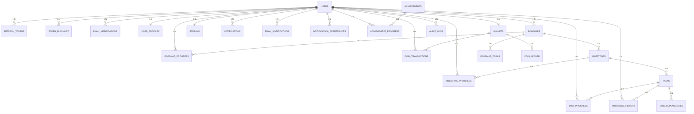

# Thadam AI - Database Design Specification

**Version**: 1.0  
**Date**: 2026-06-11  
**Database**: PostgreSQL 14+  
**Status**: Ready for Flyway Migration Implementation

---

## Table of Contents

1. [Entity Relationship Diagram](#entity-relationship-diagram)
2. [Database Design Strategies](#database-design-strategies)
3. [Table Specifications](#table-specifications)
4. [Flyway Migration Plan](#flyway-migration-plan)

---

## Entity Relationship Diagram

### Full ERD (Mermaid Format)



### ASCII Context Diagram

```
┌─────────────────────────────────────────────────────────────────────────────┐
│ AUTH CONTEXT                                                                │
│ ├─ users (main aggregate)                                                  │
│ ├─ refresh_tokens (token lifecycle)                                        │
│ ├─ token_blacklist (logout tracking)                                       │
│ └─ email_verifications (registration flow)                                 │
└─────────────────────────────────────────────────────────────────────────────┘
        ↓ owns/references
┌─────────────────────────────────────────────────────────────────────────────┐
│ USER CONTEXT                                                                │
│ ├─ user_profiles (extended user data)                                      │
│ └─ notification_preferences (user settings)                                │
└─────────────────────────────────────────────────────────────────────────────┘
        ↓ owns
┌─────────────────────────────────────────────────────────────────────────────┐
│ ROADMAP CONTEXT                                                             │
│ ├─ roadmaps (learning paths)                                               │
│ ├─ milestones (logical groupings)                                          │
│ ├─ tasks (learnable units)                                                 │
│ ├─ task_dependencies (workflow relationships)                              │
│ └─ roadmap_forks (template customization)                                  │
└─────────────────────────────────────────────────────────────────────────────┘
        ↓ tracks
┌─────────────────────────────────────────────────────────────────────────────┐
│ PROGRESS CONTEXT                                                            │
│ ├─ roadmap_progress (roadmap completion)                                   │
│ ├─ milestone_progress (milestone completion)                               │
│ ├─ task_progress (task completion)                                         │
│ └─ progress_history (audit trail)                                          │
└─────────────────────────────────────────────────────────────────────────────┘
        ↓ awards
┌─────────────────────────────────────────────────────────────────────────────┐
│ GAMIFICATION CONTEXT                                                        │
│ ├─ wallets (coin balance)                                                  │
│ ├─ coin_ledger (immutable transaction log)                                 │
│ ├─ coin_transactions (transaction records)                                 │
│ ├─ streaks (engagement tracking)                                           │
│ ├─ achievements (badges/milestones)                                        │
│ └─ achievement_progress (user achievement state)                           │
└─────────────────────────────────────────────────────────────────────────────┘
        ↓ delivers
┌─────────────────────────────────────────────────────────────────────────────┐
│ NOTIFICATION CONTEXT                                                        │
│ ├─ notifications (in-app alerts)                                           │
│ └─ email_notifications (email queue)                                       │
└─────────────────────────────────────────────────────────────────────────────┘
        ↓ publishes/consumes
┌─────────────────────────────────────────────────────────────────────────────┐
│ EVENT CONTEXT                                                               │
│ └─ outbox_events (transactional outbox pattern)                           │
└─────────────────────────────────────────────────────────────────────────────┘
        ↓ general audit
┌─────────────────────────────────────────────────────────────────────────────┐
│ COMMON/INFRASTRUCTURE                                                       │
│ └─ audit_logs (general audit trail)                                        │
└─────────────────────────────────────────────────────────────────────────────┘
```

---

## Database Design Strategies

### UUID Strategy

**Why UUID?**
- User-facing resources don't expose internal database IDs
- Prevents enumeration attacks (no sequential ID guessing)
- Allows data generation before database persistence
- Supports distributed systems and replication

**Implementation:**
- Each table has two ID columns:
  - `id BIGINT PRIMARY KEY GENERATED ALWAYS AS IDENTITY` → internal use only
  - `public_id UUID UNIQUE` → exposed in API responses
- UUID generated as `uuid_generate_v4()` at insert time
- Foreign keys use internal `BIGINT` IDs (performance, consistency)
- API layer maps between public_id and internal id

**Benefits:**
- Faster queries (BIGINT FK vs UUID FK)
- Security through obscurity (external API uses UUID)
- Small payload in API responses (can use UUID or truncated UUID)

---

### Soft Delete Strategy

**Why Soft Deletes?**
- Preserve audit trails and historical data
- Recover accidentally deleted records
- Maintain referential integrity (don't violate FKs)
- Support GDPR-compliant data retention policies

**Implementation:**
- Core entities have `deleted_at TIMESTAMP NULL`:
  - `users` — user account deletion (retains login history)
  - `roadmaps` — roadmap deletion (retains progress)
  - `tasks` — task deletion (retains completion records)
  - `email_verifications` — cleanup after verification
- Queries always filter `WHERE deleted_at IS NULL`
- Index on `(entity_id, deleted_at)` for soft-delete queries
- Hard delete only after retention period (e.g., 1 year via batch job)

**Affected Tables:**
- users
- roadmaps
- milestones
- tasks
- email_verifications

**Query Pattern:**
```sql
SELECT * FROM users WHERE deleted_at IS NULL AND active = TRUE;
```

---

### Audit Strategy

**Why Audit Fields?**
- Track who created/modified every record
- Track when changes occurred
- Support compliance and debugging
- Enable optimistic locking with `updated_at`

**Implementation:**
- All tables include:
  - `created_at TIMESTAMP DEFAULT CURRENT_TIMESTAMP`
  - `updated_at TIMESTAMP DEFAULT CURRENT_TIMESTAMP`
  - `created_by VARCHAR(255)` (user email or ID)
  - `updated_by VARCHAR(255)` (user email or ID)
- Immutable tables (like coin_ledger) have `created_at` only
- `updated_at` automatically bumped on `UPDATE`
- `AuditableListener` JPA event listener handles field population
- Separate `audit_logs` table for detailed change history

**Audit Log Table:**
```
audit_logs
├─ id (BIGINT PK)
├─ user_id (FK to users)
├─ action (CREATE, UPDATE, DELETE, SOFT_DELETE)
├─ entity_type (User, Roadmap, Task, etc.)
├─ entity_id (VARCHAR for public_id reference)
├─ changes (JSONB - before/after values)
├─ ip_address (VARCHAR for request tracking)
├─ user_agent (TEXT for browser info)
└─ created_at (immutable timestamp)
```

**Benefits:**
- Full audit trail for compliance
- Debug "who changed what when" questions
- Rollback capability (manual or automated)
- Analytics on change patterns

---

## Table Specifications

### AUTH CONTEXT TABLES

---

#### users

**Purpose**: Core user entity, implements UserDetails for Spring Security.

**Columns**:
```sql
id BIGINT PRIMARY KEY GENERATED ALWAYS AS IDENTITY
  -- Internal ID, not exposed to API

public_id UUID NOT NULL UNIQUE
  -- User-facing identifier for API responses

email VARCHAR(255) NOT NULL UNIQUE
  -- Email is the username for authentication

password_hash VARCHAR(255) NOT NULL
  -- BCrypt hashed password (no plain text ever)

name VARCHAR(255) NOT NULL
  -- User's display name

role VARCHAR(50) NOT NULL
  -- USER | MODERATOR | ADMIN (ENUM value in code)

provider VARCHAR(50) NOT NULL DEFAULT 'LOCAL'
  -- LOCAL | GOOGLE (for OAuth2 distinction)

provider_id VARCHAR(255)
  -- Google Subject ID (google_sub from ID token)
  -- NULL for LOCAL provider

email_verified BOOLEAN DEFAULT FALSE
  -- Tracks email verification status

active BOOLEAN DEFAULT TRUE
  -- Soft enable/disable without deletion

deleted_at TIMESTAMP NULL
  -- NULL = active, NOT NULL = soft deleted

created_at TIMESTAMP DEFAULT CURRENT_TIMESTAMP
  -- Immutable creation timestamp

updated_at TIMESTAMP DEFAULT CURRENT_TIMESTAMP
  -- Updated on every modification

created_by VARCHAR(255)
  -- Email of user who created this record

updated_by VARCHAR(255)
  -- Email of user who last modified this record
```

**Constraints**:
```sql
PRIMARY KEY (id)
UNIQUE (email)
UNIQUE (public_id)
UNIQUE (provider, provider_id) -- allows same email via different providers
CHECK (email LIKE '%@%')
CHECK (role IN ('USER', 'MODERATOR', 'ADMIN'))
CHECK (provider IN ('LOCAL', 'GOOGLE'))
```

**Indexes**:
```sql
CREATE INDEX idx_users_email ON users(email);
  -- Email lookup for login/password reset

CREATE INDEX idx_users_public_id ON users(public_id);
  -- API endpoint path parameters

CREATE INDEX idx_users_provider_id ON users(provider, provider_id);
  -- OAuth2 lookup by google_sub

CREATE INDEX idx_users_deleted_at ON users(deleted_at);
  -- Soft delete query filter

CREATE INDEX idx_users_active_deleted ON users(active, deleted_at);
  -- Composite for "active users"
```

**Why This Table Exists**:
- Core aggregate root for Auth, User, Progress, Gamification contexts
- Implements UserDetails interface for Spring Security
- Relationship hub for all user-owned data
- Tracks authentication state and provider
- Enables RBAC through role field

---

#### refresh_tokens

**Purpose**: Track refresh tokens for token rotation and reuse detection.

**Columns**:
```sql
id BIGINT PRIMARY KEY GENERATED ALWAYS AS IDENTITY
  -- Internal ID

user_id BIGINT NOT NULL FOREIGN KEY (users.id)
  -- Which user owns this refresh token

token_hash VARCHAR(512) NOT NULL UNIQUE
  -- Hashed token (never store plaintext)
  -- Hash = SHA256(token)

expiry_date TIMESTAMP NOT NULL
  -- When token expires (7 days from issue)

revoked BOOLEAN DEFAULT FALSE
  -- Marked revoked on logout or rotation

rotation_version INT DEFAULT 0
  -- Detects token reuse attacks
  -- Incremented on rotation
  -- If old token used after rotation → all tokens revoked

last_used_at TIMESTAMP NULL
  -- Track last refresh for analytics

created_at TIMESTAMP DEFAULT CURRENT_TIMESTAMP
  -- Issue timestamp
```

**Constraints**:
```sql
PRIMARY KEY (id)
FOREIGN KEY (user_id) REFERENCES users(id) ON DELETE CASCADE
UNIQUE (token_hash)
CHECK (expiry_date > created_at)
```

**Indexes**:
```sql
CREATE INDEX idx_refresh_tokens_user_id ON refresh_tokens(user_id);
  -- Lookup tokens for a user (logout invalidates all)

CREATE INDEX idx_refresh_tokens_token_hash ON refresh_tokens(token_hash);
  -- Validate incoming refresh token

CREATE INDEX idx_refresh_tokens_expiry ON refresh_tokens(expiry_date);
  -- Cleanup expired tokens (batch job)

CREATE INDEX idx_refresh_tokens_revoked ON refresh_tokens(revoked);
  -- Query for active tokens only
```

**Why This Table Exists**:
- Implements refresh token rotation security pattern
- Detects and prevents token reuse attacks
- Enables per-device/session tracking
- Supports graceful logout (revoke all tokens)
- Supports session invalidation on security events

**Token Rotation Flow**:
```
1. User login → issue access (15m) + refresh (7d)
2. Access expires → send refresh token
3. Backend increments rotation_version, issues new tokens
4. Old refresh token marked revoked
5. If old token reused → all tokens revoked (attack detected)
```

---

#### token_blacklist

**Purpose**: Maintain JWT blacklist for logout and token revocation.

**Columns**:
```sql
id BIGINT PRIMARY KEY GENERATED ALWAYS AS IDENTITY

token_hash VARCHAR(512) NOT NULL UNIQUE
  -- Hash of JWT (for quick lookup)

user_id BIGINT NOT NULL FOREIGN KEY (users.id)
  -- Which user's token is blacklisted

expiry_date TIMESTAMP NOT NULL
  -- When token expires (used to prune old entries)

blacklisted_at TIMESTAMP DEFAULT CURRENT_TIMESTAMP
  -- When token was revoked

reason VARCHAR(255)
  -- LOGOUT | SECURITY_EVENT | SESSION_EXPIRED
```

**Constraints**:
```sql
PRIMARY KEY (id)
FOREIGN KEY (user_id) REFERENCES users(id) ON DELETE CASCADE
UNIQUE (token_hash)
```

**Indexes**:
```sql
CREATE INDEX idx_token_blacklist_token_hash ON token_blacklist(token_hash);
  -- Check if token is blacklisted (on every request)

CREATE INDEX idx_token_blacklist_expiry ON token_blacklist(expiry_date);
  -- Prune expired entries (batch job, TTL cleanup)

CREATE INDEX idx_token_blacklist_user_id ON token_blacklist(user_id);
  -- Find all blacklisted tokens for user
```

**Why This Table Exists**:
- Immediate logout (without waiting for token expiry)
- Revoke tokens on security events
- Track revocation reason for compliance
- Prevent token reuse after revocation
- Redis could cache this (use DB as source of truth)

**Note**: In production, this should be cached in Redis with TTL = token expiry time. DB is source of truth, Redis is read cache.

---

#### email_verifications

**Purpose**: Track email verification tokens for user registration.

**Columns**:
```sql
id BIGINT PRIMARY KEY GENERATED ALWAYS AS IDENTITY

user_id BIGINT NOT NULL FOREIGN KEY (users.id)
  -- Which user is verifying email

token_hash VARCHAR(512) NOT NULL UNIQUE
  -- Hashed verification token sent in email

verified BOOLEAN DEFAULT FALSE
  -- Has user clicked the link yet

expiry_date TIMESTAMP NOT NULL
  -- Token valid for 24 hours only

created_at TIMESTAMP DEFAULT CURRENT_TIMESTAMP
  -- When token was issued

verified_at TIMESTAMP NULL
  -- When user clicked the link
```

**Constraints**:
```sql
PRIMARY KEY (id)
FOREIGN KEY (user_id) REFERENCES users(id) ON DELETE CASCADE
UNIQUE (token_hash)
CHECK (expiry_date > created_at)
```

**Indexes**:
```sql
CREATE INDEX idx_email_verifications_user_id ON email_verifications(user_id);
  -- Lookup verification for user

CREATE INDEX idx_email_verifications_token_hash ON email_verifications(token_hash);
  -- Validate token from email link

CREATE INDEX idx_email_verifications_expiry ON email_verifications(expiry_date);
  -- Prune expired tokens
```

**Why This Table Exists**:
- Confirms email ownership before account activation
- Prevents spam registrations with fake emails
- Token is single-use (one-time link)
- Supports resend functionality (create new token)
- Enables account lockdown if email compromised

**Note**: After verification, consider archiving or deleting old records (not exposed as soft delete).

---

### USER CONTEXT TABLES

---

#### user_profiles

**Purpose**: Extended user information (not required at registration).

**Columns**:
```sql
id BIGINT PRIMARY KEY GENERATED ALWAYS AS IDENTITY

user_id BIGINT NOT NULL UNIQUE FOREIGN KEY (users.id)
  -- 1:1 relationship with users

bio TEXT
  -- User bio/description

avatar_url VARCHAR(512)
  -- URL to profile picture

cover_image_url VARCHAR(512)
  -- URL to cover banner

location VARCHAR(255)
  -- Geographic location

website_url VARCHAR(512)
  -- Personal website/blog

social_links JSONB
  -- { "twitter": "@handle", "github": "username", ... }

preferences JSONB
  -- { "theme": "dark", "language": "en", ... }

created_at TIMESTAMP DEFAULT CURRENT_TIMESTAMP

updated_at TIMESTAMP DEFAULT CURRENT_TIMESTAMP
```

**Constraints**:
```sql
PRIMARY KEY (id)
FOREIGN KEY (user_id) REFERENCES users(id) ON DELETE CASCADE
UNIQUE (user_id)
```

**Indexes**:
```sql
CREATE INDEX idx_user_profiles_user_id ON user_profiles(user_id);
```

**Why This Table Exists**:
- Separates core auth (users) from profile customization
- Optional fields don't bloat users table
- Supports JSONB for flexible metadata
- Enables partial profile updates
- Social links and preferences are extensible

---

#### notification_preferences

**Purpose**: User notification opt-ins and settings.

**Columns**:
```sql
id BIGINT PRIMARY KEY GENERATED ALWAYS AS IDENTITY

user_id BIGINT NOT NULL UNIQUE FOREIGN KEY (users.id)
  -- 1:1 relationship with users

email_notifications BOOLEAN DEFAULT TRUE
  -- Receive email alerts

push_notifications BOOLEAN DEFAULT TRUE
  -- Receive in-app alerts

task_completion_notifications BOOLEAN DEFAULT TRUE
  -- Alerts when task completed

achievement_notifications BOOLEAN DEFAULT TRUE
  -- Alerts when achievement unlocked

streak_notifications BOOLEAN DEFAULT TRUE
  -- Streak milestone alerts

marketing_emails BOOLEAN DEFAULT FALSE
  -- Marketing/newsletter opt-in (GDPR compliant)

created_at TIMESTAMP DEFAULT CURRENT_TIMESTAMP

updated_at TIMESTAMP DEFAULT CURRENT_TIMESTAMP
```

**Constraints**:
```sql
PRIMARY KEY (id)
FOREIGN KEY (user_id) REFERENCES users(id) ON DELETE CASCADE
UNIQUE (user_id)
```

**Why This Table Exists**:
- GDPR-compliant consent tracking
- Reduces notification fatigue
- Per-notification-type granularity
- Enables user preference management
- Separate table allows independent updates

---

### ROADMAP CONTEXT TABLES

---

#### roadmaps

**Purpose**: Main learning path entity.

**Columns**:
```sql
id BIGINT PRIMARY KEY GENERATED ALWAYS AS IDENTITY

public_id UUID NOT NULL UNIQUE
  -- Exposed in API responses

owner_id BIGINT NOT NULL FOREIGN KEY (users.id)
  -- User who created this roadmap

title VARCHAR(255) NOT NULL
  -- Roadmap name

description TEXT
  -- Full description with learning outcomes

category VARCHAR(100)
  -- Programming, Design, Business, etc.

difficulty VARCHAR(50)
  -- BEGINNER | INTERMEDIATE | ADVANCED | EXPERT

estimated_hours INT
  -- Total learning time estimate

thumbnail_url VARCHAR(512)
  -- Cover image

is_public BOOLEAN DEFAULT FALSE
  -- Visible to other users for discovery

is_template BOOLEAN DEFAULT FALSE
  -- Can be forked by others

deleted_at TIMESTAMP NULL
  -- Soft delete

created_at TIMESTAMP DEFAULT CURRENT_TIMESTAMP

updated_at TIMESTAMP DEFAULT CURRENT_TIMESTAMP

created_by BIGINT FOREIGN KEY (users.id)
  -- User who created

updated_by BIGINT FOREIGN KEY (users.id)
  -- User who last modified
```

**Constraints**:
```sql
PRIMARY KEY (id)
FOREIGN KEY (owner_id) REFERENCES users(id) ON DELETE CASCADE
FOREIGN KEY (created_by) REFERENCES users(id) ON DELETE SET NULL
FOREIGN KEY (updated_by) REFERENCES users(id) ON DELETE SET NULL
UNIQUE (public_id)
CHECK (difficulty IN ('BEGINNER', 'INTERMEDIATE', 'ADVANCED', 'EXPERT'))
```

**Indexes**:
```sql
CREATE INDEX idx_roadmaps_owner_id ON roadmaps(owner_id);
  -- Find roadmaps by owner

CREATE INDEX idx_roadmaps_public_id ON roadmaps(public_id);
  -- API path parameter

CREATE INDEX idx_roadmaps_is_public ON roadmaps(is_public);
  -- Discovery/search

CREATE INDEX idx_roadmaps_is_template ON roadmaps(is_template);
  -- Template catalog

CREATE INDEX idx_roadmaps_created_at ON roadmaps(created_at DESC);
  -- Recent roadmaps

CREATE INDEX idx_roadmaps_category_difficulty ON roadmaps(category, difficulty);
  -- Filtering

CREATE INDEX idx_roadmaps_deleted_at ON roadmaps(deleted_at);
  -- Soft delete filter
```

**Why This Table Exists**:
- Aggregate root for roadmap context
- Organizes learning content hierarchically
- Supports discovery and search
- Tracks ownership and permissions
- Enables forking/templating patterns

---

#### milestones

**Purpose**: Logical grouping of tasks within roadmap.

**Columns**:
```sql
id BIGINT PRIMARY KEY GENERATED ALWAYS AS IDENTITY

roadmap_id BIGINT NOT NULL FOREIGN KEY (roadmaps.id)
  -- Parent roadmap

title VARCHAR(255) NOT NULL
  -- Milestone name

description TEXT
  -- What user will learn

position INT NOT NULL
  -- Order within roadmap (0, 1, 2, ...)

estimated_hours INT
  -- Time estimate for milestone

deleted_at TIMESTAMP NULL

created_at TIMESTAMP DEFAULT CURRENT_TIMESTAMP

updated_at TIMESTAMP DEFAULT CURRENT_TIMESTAMP
```

**Constraints**:
```sql
PRIMARY KEY (id)
FOREIGN KEY (roadmap_id) REFERENCES roadmaps(id) ON DELETE CASCADE
UNIQUE (roadmap_id, position) -- Can't have two milestones at same position
```

**Indexes**:
```sql
CREATE INDEX idx_milestones_roadmap_id ON milestones(roadmap_id);
  -- Fetch milestones for roadmap

CREATE INDEX idx_milestones_position ON milestones(roadmap_id, position);
  -- Order by position
```

**Why This Table Exists**:
- Organizes tasks into phases
- Provides structural hierarchy
- Enables partial completion tracking
- Supports progress percentages
- Visual checkpoint structure

---

#### tasks

**Purpose**: Individual learnable unit (assignment, lesson, project).

**Columns**:
```sql
id BIGINT PRIMARY KEY GENERATED ALWAYS AS IDENTITY

public_id UUID NOT NULL UNIQUE

milestone_id BIGINT NOT NULL FOREIGN KEY (milestones.id)
  -- Parent milestone

title VARCHAR(255) NOT NULL
  -- Task title

description TEXT
  -- Full task description

position INT NOT NULL
  -- Order within milestone

difficulty VARCHAR(50)
  -- EASY | MEDIUM | HARD

estimated_hours INT
  -- Time estimate

resources JSONB
  -- [{ "type": "video", "url": "...", "duration": 60 }, ...]

hints JSONB
  -- Hints for users who need help

deleted_at TIMESTAMP NULL

created_at TIMESTAMP DEFAULT CURRENT_TIMESTAMP

updated_at TIMESTAMP DEFAULT CURRENT_TIMESTAMP
```

**Constraints**:
```sql
PRIMARY KEY (id)
FOREIGN KEY (milestone_id) REFERENCES milestones(id) ON DELETE CASCADE
UNIQUE (public_id)
UNIQUE (milestone_id, position)
CHECK (difficulty IN ('EASY', 'MEDIUM', 'HARD'))
```

**Indexes**:
```sql
CREATE INDEX idx_tasks_milestone_id ON tasks(milestone_id);
CREATE INDEX idx_tasks_public_id ON tasks(public_id);
CREATE INDEX idx_tasks_position ON tasks(milestone_id, position);
```

**Why This Table Exists**:
- Atomic learning unit
- Supports progress tracking per task
- Tracks difficulty and time estimates
- Stores learning resources (videos, links, PDFs)
- Enables dependency management

---

#### task_dependencies

**Purpose**: Define prerequisite relationships between tasks.

**Columns**:
```sql
id BIGINT PRIMARY KEY GENERATED ALWAYS AS IDENTITY

parent_task_id BIGINT NOT NULL FOREIGN KEY (tasks.id)
  -- Task that must be completed first

dependent_task_id BIGINT NOT NULL FOREIGN KEY (tasks.id)
  -- Task that depends on parent

dependency_type VARCHAR(50)
  -- HARD (must complete) | SOFT (recommended)

created_at TIMESTAMP DEFAULT CURRENT_TIMESTAMP
```

**Constraints**:
```sql
PRIMARY KEY (id)
FOREIGN KEY (parent_task_id) REFERENCES tasks(id) ON DELETE CASCADE
FOREIGN KEY (dependent_task_id) REFERENCES tasks(id) ON DELETE CASCADE
UNIQUE (parent_task_id, dependent_task_id)
CHECK (parent_task_id != dependent_task_id)
CHECK (dependency_type IN ('HARD', 'SOFT'))
```

**Indexes**:
```sql
CREATE INDEX idx_task_dependencies_parent ON task_dependencies(parent_task_id);
  -- Find tasks that depend on this parent

CREATE INDEX idx_task_dependencies_dependent ON task_dependencies(dependent_task_id);
  -- Find prerequisites for this task
```

**Why This Table Exists**:
- Models workflow constraints
- Prevents task completion without prerequisites
- Supports circular dependency detection
- Enables topological sorting for task ordering
- Differentiates required vs. recommended prerequisites

---

#### roadmap_forks

**Purpose**: Track template copying for analytics and attribution.

**Columns**:
```sql
id BIGINT PRIMARY KEY GENERATED ALWAYS AS IDENTITY

original_roadmap_id BIGINT NOT NULL FOREIGN KEY (roadmaps.id)
  -- Template roadmap

forked_roadmap_id BIGINT NOT NULL FOREIGN KEY (roadmaps.id)
  -- New forked copy

forked_by_user_id BIGINT FOREIGN KEY (users.id)
  -- Who forked it

forked_at TIMESTAMP DEFAULT CURRENT_TIMESTAMP
```

**Constraints**:
```sql
PRIMARY KEY (id)
FOREIGN KEY (original_roadmap_id) REFERENCES roadmaps(id) ON DELETE CASCADE
FOREIGN KEY (forked_roadmap_id) REFERENCES roadmaps(id) ON DELETE CASCADE
FOREIGN KEY (forked_by_user_id) REFERENCES users(id) ON DELETE SET NULL
```

**Indexes**:
```sql
CREATE INDEX idx_roadmap_forks_original ON roadmap_forks(original_roadmap_id);
CREATE INDEX idx_roadmap_forks_forked ON roadmap_forks(forked_roadmap_id);
```

**Why This Table Exists**:
- Analytics: track template popularity
- Attribution: give credit to template creator
- Recommendations: suggest templates based on forks
- Community: discover trending templates
- Legal: track derivative works

---

### PROGRESS CONTEXT TABLES

---

#### roadmap_progress

**Purpose**: User progress on entire roadmap.

**Columns**:
```sql
id BIGINT PRIMARY KEY GENERATED ALWAYS AS IDENTITY

user_id BIGINT NOT NULL FOREIGN KEY (users.id)

roadmap_id BIGINT NOT NULL FOREIGN KEY (roadmaps.id)

status VARCHAR(50) DEFAULT 'NOT_STARTED'
  -- NOT_STARTED | IN_PROGRESS | COMPLETED | ABANDONED

completion_percentage INT DEFAULT 0
  -- 0-100, auto-calculated from task_progress

started_at TIMESTAMP NULL
  -- When user started roadmap

completed_at TIMESTAMP NULL
  -- When user finished roadmap

created_at TIMESTAMP DEFAULT CURRENT_TIMESTAMP

updated_at TIMESTAMP DEFAULT CURRENT_TIMESTAMP
```

**Constraints**:
```sql
PRIMARY KEY (id)
FOREIGN KEY (user_id) REFERENCES users(id) ON DELETE CASCADE
FOREIGN KEY (roadmap_id) REFERENCES roadmaps(id) ON DELETE CASCADE
UNIQUE (user_id, roadmap_id)
CHECK (completion_percentage BETWEEN 0 AND 100)
CHECK (status IN ('NOT_STARTED', 'IN_PROGRESS', 'COMPLETED', 'ABANDONED'))
```

**Indexes**:
```sql
CREATE INDEX idx_roadmap_progress_user_id ON roadmap_progress(user_id);
  -- Find all roadmaps user is taking

CREATE INDEX idx_roadmap_progress_roadmap_id ON roadmap_progress(roadmap_id);
  -- Find all users taking this roadmap

CREATE INDEX idx_roadmap_progress_status ON roadmap_progress(status);
  -- Query by status
```

**Why This Table Exists**:
- Tracks which roadmaps user is actively working on
- Stores completion percentage (auto-calculated)
- Records start and completion times
- Enables leaderboards and analytics
- Supports resume functionality

---

#### task_progress

**Purpose**: User progress on individual task.

**Columns**:
```sql
id BIGINT PRIMARY KEY GENERATED ALWAYS AS IDENTITY

user_id BIGINT NOT NULL FOREIGN KEY (users.id)

task_id BIGINT NOT NULL FOREIGN KEY (tasks.id)

status VARCHAR(50) DEFAULT 'TODO'
  -- TODO | IN_PROGRESS | COMPLETED | BLOCKED

started_at TIMESTAMP NULL

completed_at TIMESTAMP NULL

attempts INT DEFAULT 0
  -- How many times user tried task

proof_url VARCHAR(512)
  -- Link to submitted work (GitHub PR, design file, etc.)

proof_notes TEXT
  -- User notes on submission

reviewed_by_user_id BIGINT FOREIGN KEY (users.id)
  -- Moderator/peer review

reviewed_at TIMESTAMP

review_feedback TEXT

created_at TIMESTAMP DEFAULT CURRENT_TIMESTAMP

updated_at TIMESTAMP DEFAULT CURRENT_TIMESTAMP
```

**Constraints**:
```sql
PRIMARY KEY (id)
FOREIGN KEY (user_id) REFERENCES users(id) ON DELETE CASCADE
FOREIGN KEY (task_id) REFERENCES tasks(id) ON DELETE CASCADE
FOREIGN KEY (reviewed_by_user_id) REFERENCES users(id) ON DELETE SET NULL
UNIQUE (user_id, task_id)
CHECK (status IN ('TODO', 'IN_PROGRESS', 'COMPLETED', 'BLOCKED'))
```

**Indexes**:
```sql
CREATE INDEX idx_task_progress_user_id ON task_progress(user_id);
CREATE INDEX idx_task_progress_task_id ON task_progress(task_id);
CREATE INDEX idx_task_progress_status ON task_progress(status);
CREATE INDEX idx_task_progress_completed_at ON task_progress(completed_at DESC);
```

**Why This Table Exists**:
- Tracks individual task completion
- Records proof of work (portfolio link)
- Supports peer/moderator review workflow
- Enables retry tracking (attempts)
- Records task blocking (depends on other task)

---

#### milestone_progress

**Purpose**: User progress on milestone (aggregate of tasks).

**Columns**:
```sql
id BIGINT PRIMARY KEY GENERATED ALWAYS AS IDENTITY

user_id BIGINT NOT NULL FOREIGN KEY (users.id)

milestone_id BIGINT NOT NULL FOREIGN KEY (milestones.id)

status VARCHAR(50) DEFAULT 'NOT_STARTED'

completion_percentage INT DEFAULT 0

started_at TIMESTAMP NULL

completed_at TIMESTAMP NULL

created_at TIMESTAMP DEFAULT CURRENT_TIMESTAMP

updated_at TIMESTAMP DEFAULT CURRENT_TIMESTAMP
```

**Constraints**:
```sql
PRIMARY KEY (id)
FOREIGN KEY (user_id) REFERENCES users(id) ON DELETE CASCADE
FOREIGN KEY (milestone_id) REFERENCES milestones(id) ON DELETE CASCADE
UNIQUE (user_id, milestone_id)
```

**Why This Table Exists**:
- Tracks milestone completion (parent of task_progress)
- Auto-calculated from child tasks
- Enables milestone-level rewards/achievements
- Supports progress visualization by milestone
- Caches calculated completion percentage

---

#### progress_history

**Purpose**: Audit trail of progress changes for analytics.

**Columns**:
```sql
id BIGINT PRIMARY KEY GENERATED ALWAYS AS IDENTITY

user_id BIGINT NOT NULL FOREIGN KEY (users.id)

task_id BIGINT NOT NULL FOREIGN KEY (tasks.id)

old_status VARCHAR(50)

new_status VARCHAR(50)

changed_at TIMESTAMP DEFAULT CURRENT_TIMESTAMP
```

**Constraints**:
```sql
PRIMARY KEY (id)
FOREIGN KEY (user_id) REFERENCES users(id) ON DELETE CASCADE
FOREIGN KEY (task_id) REFERENCES tasks(id) ON DELETE CASCADE
```

**Indexes**:
```sql
CREATE INDEX idx_progress_history_user_id ON progress_history(user_id);
CREATE INDEX idx_progress_history_task_id ON progress_history(task_id);
CREATE INDEX idx_progress_history_changed_at ON progress_history(changed_at DESC);
```

**Why This Table Exists**:
- Complete audit trail of status changes
- Analytics on user behavior (time per status, retries)
- Debugging (trace how user completed task)
- Compliance (prove completion date)
- Historical reports (trends over time)

---

### GAMIFICATION CONTEXT TABLES

---

#### wallets

**Purpose**: User's coin balance account.

**Columns**:
```sql
id BIGINT PRIMARY KEY GENERATED ALWAYS AS IDENTITY

user_id BIGINT NOT NULL UNIQUE FOREIGN KEY (users.id)
  -- 1:1 relationship with users

balance BIGINT DEFAULT 0
  -- Current balance (cached from ledger sum)

total_earned BIGINT DEFAULT 0
  -- Lifetime earnings

total_spent BIGINT DEFAULT 0
  -- Lifetime spending

created_at TIMESTAMP DEFAULT CURRENT_TIMESTAMP

updated_at TIMESTAMP DEFAULT CURRENT_TIMESTAMP
```

**Constraints**:
```sql
PRIMARY KEY (id)
FOREIGN KEY (user_id) REFERENCES users(id) ON DELETE CASCADE
UNIQUE (user_id)
CHECK (balance >= 0) -- Can't go negative
```

**Indexes**:
```sql
CREATE INDEX idx_wallets_user_id ON wallets(user_id);
```

**Why This Table Exists**:
- Performance: cache current balance (avoid SELECT SUM(amount) FROM coin_ledger)
- ACID: single row update for atomicity
- Consistency: triggers or service code ensures ledger matches balance
- Reports: quick access to lifetime stats

**Important**: balance must match `SUM(amount) FROM coin_ledger WHERE wallet_id = ?` (reconcile daily).

---

#### coin_ledger

**Purpose**: Immutable transaction log (source of truth for balance).

**Columns**:
```sql
id BIGINT PRIMARY KEY GENERATED ALWAYS AS IDENTITY

wallet_id BIGINT NOT NULL FOREIGN KEY (wallets.id)

transaction_id BIGINT UNIQUE
  -- Reference to specific transaction (e.g., task completion ID)

amount BIGINT NOT NULL
  -- Positive (earn) or negative (spend)

transaction_type VARCHAR(50) NOT NULL
  -- EARN | SPEND

source VARCHAR(100)
  -- TASK_COMPLETION | REFERRAL | BONUS | REWARD_REDEMPTION | ADMIN_ADJUST

description VARCHAR(512)
  -- Human description of transaction

metadata JSONB
  -- Additional context: { "task_id": "uuid", "achievement_id": "uuid" }

created_at TIMESTAMP DEFAULT CURRENT_TIMESTAMP
```

**Constraints**:
```sql
PRIMARY KEY (id)
FOREIGN KEY (wallet_id) REFERENCES wallets(id) ON DELETE CASCADE
UNIQUE (transaction_id)
CHECK (amount != 0)
CHECK (transaction_type IN ('EARN', 'SPEND'))
```

**Indexes**:
```sql
CREATE INDEX idx_coin_ledger_wallet_id ON coin_ledger(wallet_id);
CREATE INDEX idx_coin_ledger_created_at ON coin_ledger(created_at DESC);
CREATE INDEX idx_coin_ledger_source ON coin_ledger(source);
```

**Why This Table Exists**:
- Immutable record (APPEND ONLY, never UPDATE)
- Financial audit trail
- Reconciliation source (calculate balance from here)
- Prevents fraud (can't modify transactions)
- Compliance (GDPR audit trail)
- Analytics (spending patterns)

**Important Rules**:
- NEVER UPDATE OR DELETE records
- Always append only
- Calculate balance by: `SELECT SUM(amount) FROM coin_ledger WHERE wallet_id = ?`
- Reconcile wallet.balance against ledger daily (alert if mismatch)

---

#### coin_transactions

**Purpose**: Additional transaction metadata (could be denormalized with ledger).

**Columns**:
```sql
id BIGINT PRIMARY KEY GENERATED ALWAYS AS IDENTITY

wallet_id BIGINT NOT NULL FOREIGN KEY (wallets.id)

amount BIGINT NOT NULL

transaction_type VARCHAR(50) NOT NULL

source VARCHAR(100) NOT NULL

description VARCHAR(512)

reference_id VARCHAR(255)
  -- ID of task/achievement that triggered this

reference_type VARCHAR(100)
  -- TASK | ACHIEVEMENT | REFERRAL

metadata JSONB

created_at TIMESTAMP DEFAULT CURRENT_TIMESTAMP
```

**Why This Table Exists**:
- Matches coin_ledger but with different structure
- Could be normalized away (optional denormalization)
- Use either ledger OR transactions (not both)
- OR use transactions + denormalized balance cache

**Note**: In final implementation, coin_transactions and coin_ledger can be merged.

---

#### streaks

**Purpose**: Track daily completion streaks.

**Columns**:
```sql
id BIGINT PRIMARY KEY GENERATED ALWAYS AS IDENTITY

user_id BIGINT NOT NULL UNIQUE FOREIGN KEY (users.id)
  -- 1:1 relationship

current_streak INT DEFAULT 0
  -- Days in current streak (resets on miss)

longest_streak INT DEFAULT 0
  -- Best streak ever

last_activity_date DATE NULL
  -- Last day user completed a task

created_at TIMESTAMP DEFAULT CURRENT_TIMESTAMP

updated_at TIMESTAMP DEFAULT CURRENT_TIMESTAMP
```

**Constraints**:
```sql
PRIMARY KEY (id)
FOREIGN KEY (user_id) REFERENCES users(id) ON DELETE CASCADE
UNIQUE (user_id)
CHECK (current_streak >= 0)
CHECK (longest_streak >= 0)
```

**Indexes**:
```sql
CREATE INDEX idx_streaks_user_id ON streaks(user_id);
CREATE INDEX idx_streaks_current_streak ON streaks(current_streak DESC);
  -- Leaderboard by current streak

CREATE INDEX idx_streaks_longest_streak ON streaks(longest_streak DESC);
  -- Leaderboard by longest streak
```

**Why This Table Exists**:
- Gamification: encourages daily engagement
- Leaderboards: compare streaks
- Achievements: unlock badges for streaks
- Retention: psychological incentive

**Update Logic**:
```
1. User completes task today
2. if today == last_activity_date + 1 day → current_streak++
3. if today == last_activity_date → no change (already completed today)
4. if today > last_activity_date + 1 day → current_streak = 1 (streak broken)
5. Update longest_streak if current > longest
6. Set last_activity_date = today
```

---

#### achievements

**Purpose**: Achievement badge definitions.

**Columns**:
```sql
id BIGINT PRIMARY KEY GENERATED ALWAYS AS IDENTITY

public_id UUID NOT NULL UNIQUE

name VARCHAR(255) NOT NULL UNIQUE
  -- "First Task Completed", "Week Warrior", etc.

description TEXT

icon_url VARCHAR(512)
  -- Badge image URL

badge_type VARCHAR(100)
  -- MILESTONE (tasks completed) | STREAK (daily) | SOCIAL (referrals) | ACHIEVEMENT (special)

criteria JSONB
  -- { "type": "tasks_completed", "count": 10 }

reward_coins INT DEFAULT 0
  -- Bonus coins when unlocked

created_at TIMESTAMP DEFAULT CURRENT_TIMESTAMP
```

**Constraints**:
```sql
PRIMARY KEY (id)
UNIQUE (public_id)
UNIQUE (name)
CHECK (reward_coins >= 0)
```

**Indexes**:
```sql
CREATE INDEX idx_achievements_public_id ON achievements(public_id);
CREATE INDEX idx_achievements_badge_type ON achievements(badge_type);
```

**Why This Table Exists**:
- Defines achievement system
- Decouples badge logic from data
- Enables admins to create new achievements
- Supports localization (name/description in code)
- Tracks reward amounts

---

#### achievement_progress

**Purpose**: Track user progress toward achievements.

**Columns**:
```sql
id BIGINT PRIMARY KEY GENERATED ALWAYS AS IDENTITY

user_id BIGINT NOT NULL FOREIGN KEY (users.id)

achievement_id BIGINT NOT NULL FOREIGN KEY (achievements.id)

progress INT DEFAULT 0
  -- 0-100 or task count depending on achievement

unlocked BOOLEAN DEFAULT FALSE

unlocked_at TIMESTAMP NULL
  -- When achievement was unlocked

created_at TIMESTAMP DEFAULT CURRENT_TIMESTAMP

updated_at TIMESTAMP DEFAULT CURRENT_TIMESTAMP
```

**Constraints**:
```sql
PRIMARY KEY (id)
FOREIGN KEY (user_id) REFERENCES users(id) ON DELETE CASCADE
FOREIGN KEY (achievement_id) REFERENCES achievements(id) ON DELETE CASCADE
UNIQUE (user_id, achievement_id)
```

**Indexes**:
```sql
CREATE INDEX idx_achievement_progress_user_id ON achievement_progress(user_id);
CREATE INDEX idx_achievement_progress_unlocked ON achievement_progress(unlocked);
  -- Find all unlocked achievements for user
```

**Why This Table Exists**:
- Tracks user's progress toward each badge
- Stores unlock timestamp
- Enables progress notifications ("you're 7/10 away")
- Supports unlock events and rewards

---

### NOTIFICATION CONTEXT TABLES

---

#### notifications

**Purpose**: In-app notification queue.

**Columns**:
```sql
id BIGINT PRIMARY KEY GENERATED ALWAYS AS IDENTITY

user_id BIGINT NOT NULL FOREIGN KEY (users.id)

type VARCHAR(100) NOT NULL
  -- TASK_COMPLETED | ACHIEVEMENT_UNLOCKED | STREAK_MILESTONE | SYSTEM

title VARCHAR(255) NOT NULL

message TEXT NOT NULL

data JSONB
  -- Links, IDs, metadata relevant to notification

read BOOLEAN DEFAULT FALSE

read_at TIMESTAMP NULL

created_at TIMESTAMP DEFAULT CURRENT_TIMESTAMP
```

**Constraints**:
```sql
PRIMARY KEY (id)
FOREIGN KEY (user_id) REFERENCES users(id) ON DELETE CASCADE
```

**Indexes**:
```sql
CREATE INDEX idx_notifications_user_id ON notifications(user_id);
CREATE INDEX idx_notifications_created_at ON notifications(created_at DESC);
CREATE INDEX idx_notifications_read ON notifications(read);
```

**Why This Table Exists**:
- Transient notification history
- User notification dashboard
- Analytics (notification engagement)
- Old records can be purged (retention policy)

---

#### email_notifications

**Purpose**: Email notification queue for async sending.

**Columns**:
```sql
id BIGINT PRIMARY KEY GENERATED ALWAYS AS IDENTITY

user_id BIGINT NOT NULL FOREIGN KEY (users.id)

email VARCHAR(255) NOT NULL

subject VARCHAR(255) NOT NULL

template_name VARCHAR(100)
  -- welcome | task_reminder | achievement | weekly_digest

template_data JSONB
  -- Variables to insert into template

status VARCHAR(50) DEFAULT 'PENDING'
  -- PENDING | SENT | FAILED | BOUNCED

sent_at TIMESTAMP NULL

failed_reason TEXT
  -- Why email failed (SMTP error, invalid email, etc.)

created_at TIMESTAMP DEFAULT CURRENT_TIMESTAMP
```

**Constraints**:
```sql
PRIMARY KEY (id)
FOREIGN KEY (user_id) REFERENCES users(id) ON DELETE CASCADE
CHECK (status IN ('PENDING', 'SENT', 'FAILED', 'BOUNCED'))
```

**Indexes**:
```sql
CREATE INDEX idx_email_notifications_status ON email_notifications(status);
  -- Find pending emails to send

CREATE INDEX idx_email_notifications_created_at ON email_notifications(created_at);
```

**Why This Table Exists**:
- Decouples email generation from sending
- Supports retry logic (check failed emails)
- Audit trail (which emails sent)
- Compliance (email delivery proof)
- Analytics (email engagement)

---

### EVENT CONTEXT TABLES

---

#### outbox_events

**Purpose**: Transactional outbox pattern for guaranteed event delivery.

**Columns**:
```sql
id BIGINT PRIMARY KEY GENERATED ALWAYS AS IDENTITY

aggregate_id VARCHAR(255) NOT NULL
  -- ID of entity that triggered event (user_id, task_id, etc.)

aggregate_type VARCHAR(100) NOT NULL
  -- User | Task | Roadmap | Achievement

event_type VARCHAR(100) NOT NULL
  -- UserRegistered | TaskCompleted | CoinsEarned

payload JSONB NOT NULL
  -- Complete event data (all relevant fields)

created_at TIMESTAMP DEFAULT CURRENT_TIMESTAMP

published_at TIMESTAMP NULL
  -- When event was published to listeners

failed BOOLEAN DEFAULT FALSE
  -- Did publishing fail?

failure_reason TEXT

retry_count INT DEFAULT 0
```

**Constraints**:
```sql
PRIMARY KEY (id)
```

**Indexes**:
```sql
CREATE INDEX idx_outbox_events_published ON outbox_events(published_at);
  -- Find unpublished events

CREATE INDEX idx_outbox_events_failed ON outbox_events(failed);
  -- Find failed events for retry

CREATE INDEX idx_outbox_events_created_at ON outbox_events(created_at);
```

**Why This Table Exists**:
- Guarantees no lost events (even if app crashes)
- Decouples service from event publishing
- Enables reliable async processing
- Supports event replay/debugging
- Provides event audit trail

**How It Works**:
```
1. Service saves aggregate + outbox_event in same transaction
2. Transaction commits (either both succeed or both fail)
3. Separate async poller reads unpublished events
4. Poller publishes to event listeners
5. Listeners update their databases
6. Poller marks event as published
7. If crash at step 5, poller retries (exactly-once guarantee)
8. Old published events archived/deleted after retention
```

---

### COMMON/INFRASTRUCTURE TABLES

---

#### audit_logs

**Purpose**: General-purpose audit trail for sensitive operations.

**Columns**:
```sql
id BIGINT PRIMARY KEY GENERATED ALWAYS AS IDENTITY

user_id BIGINT FOREIGN KEY (users.id)
  -- Who performed the action (null for system)

action VARCHAR(100) NOT NULL
  -- CREATE | UPDATE | DELETE | SOFT_DELETE | CHANGE_ROLE | LOGIN_FAILED

entity_type VARCHAR(100) NOT NULL
  -- User | Roadmap | Task | Wallet | Achievement

entity_id VARCHAR(255)
  -- public_id of entity (for traceability)

changes JSONB
  -- { "role": { "old": "USER", "new": "ADMIN" }, ... }

ip_address VARCHAR(45)
  -- IPv4 or IPv6 of request

user_agent TEXT
  -- Browser/client info

created_at TIMESTAMP DEFAULT CURRENT_TIMESTAMP
```

**Constraints**:
```sql
PRIMARY KEY (id)
FOREIGN KEY (user_id) REFERENCES users(id) ON DELETE SET NULL
```

**Indexes**:
```sql
CREATE INDEX idx_audit_logs_user_id ON audit_logs(user_id);
CREATE INDEX idx_audit_logs_entity_type ON audit_logs(entity_type);
CREATE INDEX idx_audit_logs_created_at ON audit_logs(created_at DESC);
CREATE INDEX idx_audit_logs_action ON audit_logs(action);
```

**Why This Table Exists**:
- Compliance: GDPR, SOC 2, audit requirements
- Security: detect suspicious activity
- Debugging: understand what happened
- Accountability: who made changes
- Legal: proof of actions for disputes

---

## Flyway Migration Plan

### Migration Strategy

**Philosophy**:
- One migration per schema change
- Migrations are immutable once committed
- Forward-only migrations (no downtime)
- Backward compatibility when possible
- Schema versions tracked by Flyway

**File Naming**:
- `V{number}__{description}.sql`
- Example: `V1__create_users.sql`
- Flyway executes in numeric order
- Always increment version, never repeat

---

### Migration Sequence

#### V1__create_users.sql
**Creates**: users table  
**Why**: Core authentication entity. All other tables depend on users.  
**Size**: ~50 lines  
**Changes**:
- users table with roles, providers, soft delete
- Indexes for email, public_id, provider lookups
- Constraints for roles and providers

---

#### V2__create_user_profiles.sql
**Creates**: user_profiles, notification_preferences tables  
**Why**: Extended user data (non-critical, optional on first login).  
**Size**: ~30 lines  
**Changes**:
- user_profiles with JSONB for flexible fields
- notification_preferences with boolean flags

---

#### V3__create_auth_tokens.sql
**Creates**: refresh_tokens, token_blacklist, email_verifications tables  
**Why**: Authentication token lifecycle management.  
**Size**: ~60 lines  
**Changes**:
- refresh_tokens for rotation and reuse detection
- token_blacklist for logout/revocation
- email_verifications for registration
- Indexes for hash lookups and expiry cleanup

---

#### V4__create_roadmaps.sql
**Creates**: roadmaps, milestones, tasks, task_dependencies, roadmap_forks tables  
**Why**: Core learning content structure.  
**Size**: ~100 lines  
**Changes**:
- roadmaps with ownership and publishing
- milestones with ordering
- tasks with resources (JSONB)
- task_dependencies for prerequisites
- roadmap_forks for template tracking
- Composite indexes for filtering/sorting

---

#### V5__create_progress_tables.sql
**Creates**: roadmap_progress, milestone_progress, task_progress, progress_history tables  
**Why**: User progress tracking across all levels.  
**Size**: ~80 lines  
**Changes**:
- Three-level progress hierarchy
- completion_percentage caching
- progress_history for audit
- Indexes for user queries and sorting

---

#### V6__create_gamification_tables.sql
**Creates**: wallets, coin_ledger, coin_transactions, streaks, achievements, achievement_progress tables  
**Why**: Coins, badges, and daily engagement mechanics.  
**Size**: ~110 lines  
**Changes**:
- wallets for coin balance
- coin_ledger (immutable append-only)
- coin_transactions (transaction records)
- streaks with current/longest tracking
- achievements definitions
- achievement_progress per user

---

#### V7__create_notification_tables.sql
**Creates**: notifications, email_notifications tables  
**Why**: In-app and email notification system.  
**Size**: ~50 lines  
**Changes**:
- notifications (in-app, read status)
- email_notifications (queue with status)
- Status columns for PENDING/SENT/FAILED
- Indexes for status queries

---

#### V8__create_event_table.sql
**Creates**: outbox_events table  
**Why**: Transactional outbox pattern for event reliability.  
**Size**: ~40 lines  
**Changes**:
- outbox_events with aggregate_id/type/event_type
- Payload as JSONB
- published_at and failed tracking
- Indexes for polling

---

#### V9__create_audit_logs.sql
**Creates**: audit_logs table  
**Why**: Compliance and security audit trail.  
**Size**: ~40 lines  
**Changes**:
- audit_logs with action, entity type, changes
- IP and user agent tracking
- Indexes for queries

---

#### V10__create_indexes_and_constraints.sql
**Adds**: Missing indexes, foreign keys constraints, check constraints  
**Why**: Performance and data integrity (can be applied after data exists).  
**Size**: ~80 lines  
**Changes**:
- Composite indexes for common queries
- Foreign key constraints for referential integrity
- Check constraints for valid values

---

#### V11__create_functions_and_triggers.sql
**Creates**: PostgreSQL functions and triggers  
**Why**: Automate common tasks (audit field updates, soft deletes, etc.).  
**Size**: ~100 lines  
**Changes**:
- Trigger: auto-update `updated_at` on record change
- Trigger: cascade soft delete to child records
- Trigger: audit log on sensitive changes
- Function: calculate roadmap_progress percentage
- Function: detect task dependency cycles

---

#### V12__load_achievement_definitions.sql
**Inserts**: Achievement seed data  
**Why**: Predefined badges (can't dynamically create during startup).  
**Size**: ~50 lines  
**Changes**:
- INSERT INTO achievements (10-20 badge definitions)
- First Task Completed
- Week Warrior (7-day streak)
- Learner (10 tasks)
- Master (50 tasks)
- etc.

---

### Summary

| Version | File | Tables Created | Purpose |
|---------|------|-----------------|---------|
| V1 | users | users | Core auth |
| V2 | profiles | user_profiles, notification_preferences | User data |
| V3 | tokens | refresh_tokens, token_blacklist, email_verifications | Auth lifecycle |
| V4 | roadmaps | roadmaps, milestones, tasks, task_dependencies, roadmap_forks | Content structure |
| V5 | progress | roadmap_progress, milestone_progress, task_progress, progress_history | Progress tracking |
| V6 | gamification | wallets, coin_ledger, coin_transactions, streaks, achievements, achievement_progress | Engagement |
| V7 | notifications | notifications, email_notifications | Alerts |
| V8 | events | outbox_events | Event reliability |
| V9 | audit | audit_logs | Compliance |
| V10 | indexes | (various) | Performance |
| V11 | functions | (functions/triggers) | Automation |
| V12 | achievements | (seed data) | Badge system |

**Total**: ~12 migrations, ~700 lines of SQL, ~35 tables, ~50 indexes

---

## Design Validation Checklist

✅ **Normalization**
- All tables normalized to 3NF
- No data duplication
- JSONB used appropriately for semi-structured data

✅ **Performance**
- Indexes on all foreign keys
- Indexes on commonly filtered columns (email, public_id, deleted_at)
- Composite indexes for multi-column queries
- Partitioning strategy prepared for large tables (audit_logs, progress_history)

✅ **Security**
- No sensitive data in plaintext (passwords hashed, tokens hashed)
- Row-level security (RLS) policies can be added per context
- Audit trails for sensitive operations
- Soft deletes prevent accidental data loss

✅ **Scalability**
- UUID public IDs for distributed systems
- Sharding keys identified (user_id, roadmap_id)
- Event sourcing ready (outbox pattern)
- Read replicas possible (immutable ledgers)

✅ **Compliance**
- GDPR: soft deletes, audit logs, user consent (notification_preferences)
- SOC 2: audit trails, data retention, change tracking
- HIPAA: not applicable (educational content, not healthcare)

✅ **Data Integrity**
- Foreign key constraints enforce relationships
- Unique constraints prevent duplicates
- Check constraints enforce domain rules
- NOT NULL constraints prevent null keys

✅ **Auditability**
- All changes tracked (created_by, updated_by, timestamps)
- Full audit_logs table for sensitive operations
- progress_history for learning analytics
- outbox_events for event chain tracking

---

## Schema Evolution Roadmap

### Phase 1: MVP (V1-V9)
All tables for core features: auth, users, roadmaps, progress, gamification, notifications.

### Phase 2: Enterprise Features (V13-V15)
- V13: Add multi-tenancy columns (organization_id)
- V14: Add team collaboration (roadmap shares, roles)
- V15: Add course enrollment (prerequisites, certificates)

### Phase 3: Analytics (V16-V18)
- V16: Denormalized materialized views for dashboards
- V17: Time-series tables for analytics (compressed)
- V18: Data warehouse schema (facts and dimensions)

### Phase 4: Advanced Features (V19+)
- V19: Comments and discussions (social)
- V20: Recommendations engine (vectors, embeddings)
- V21: Integration webhooks (external systems)

---

**End of Database Design Specification**

**Next Steps**: Proceed to Prompt 3 (Flyway Migrations) to generate actual SQL files.

